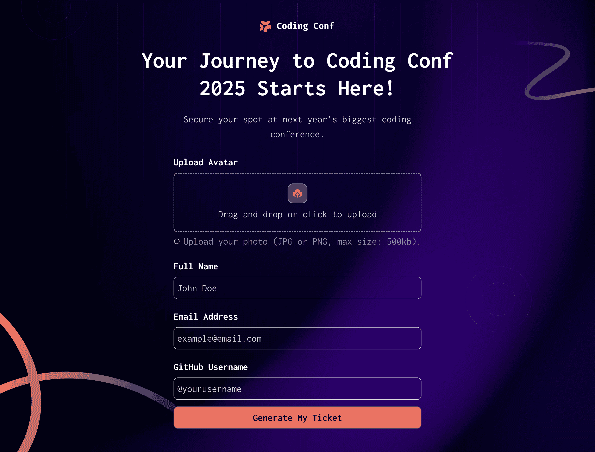
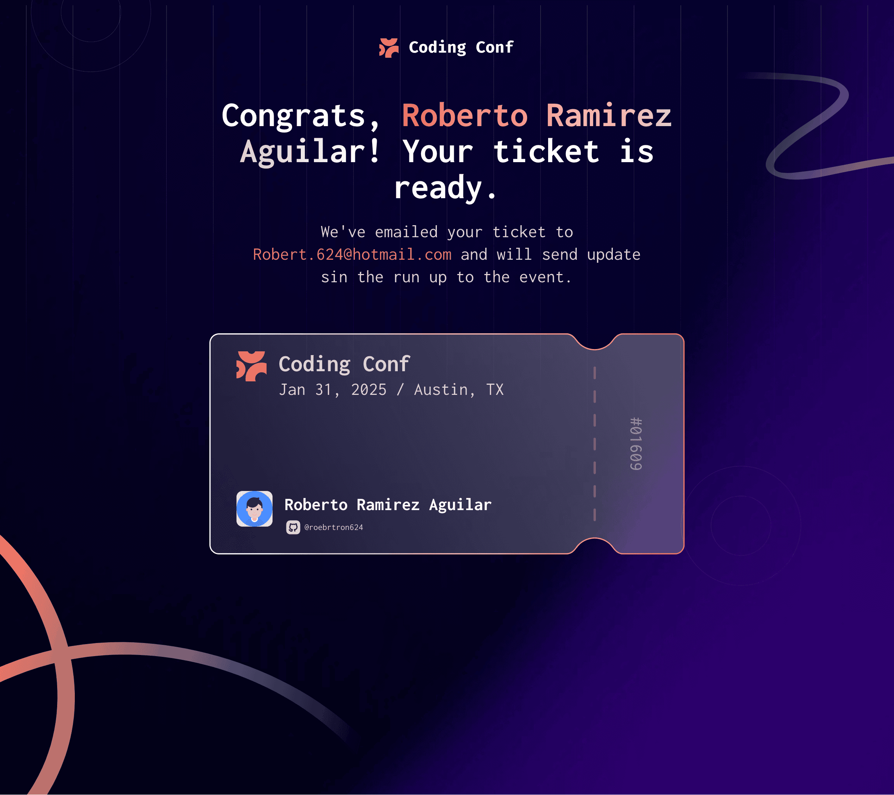

# Frontend Mentor - Conference ticket generator solution

This is a solution to the [Conference ticket generator challenge on Frontend Mentor](https://www.frontendmentor.io/challenges/conference-ticket-generator-oq5gFIU12w). Frontend Mentor challenges help you improve your coding skills by building realistic projects. 

## Table of contents

- [Overview](#overview)
  - [The challenge](#the-challenge)
  - [Screenshot](#screenshot)
  - [Links](#links)
- [My process](#my-process)
  - [Built with](#built-with)
  - [What I learned](#what-i-learned)
  - [Continued development](#continued-development)
  - [Useful resources](#useful-resources)
- [Author](#author)

## Overview

### The challenge

Users should be able to:

- Complete the form with their details
- Receive form validation messages if:
  - Any field is missed
  - The email address is not formatted correctly
  - The avatar upload is too big or the wrong image format
- Complete the form only using their keyboard
- Have inputs, form field hints, and error messages announced on their screen reader
- See the generated conference ticket when they successfully submit the form
- View the optimal layout for the interface depending on their device's screen size
- See hover and focus states for all interactive elements on the page

### Screenshot

Form page

Ticket page

### Links

- [Solution URL](https://github.com/Robertron624/conference-ticket-generator)
- [Live Site URL](https://robetron-coference-ticket.netlify.app/)

## My process

### Built with

- [Svelte](https://svelte.dev/) - JS framework
- [Vite](https://vitejs.dev/) - Build tool
- [TypeScript](https://www.typescriptlang.org/) - For type safety
- [SASS](https://sass-lang.com/) - For styles
- Semantic HTML5 markup
- CSS custom properties
- Flexbox
- CSS Grid
- Mobile-first workflow

### What I learned

I got to keep learning about svelte and its components, and how to use them in a project, combining them with SASS for styling, and TypeScript for type safety. 
I also got to learn about the accessibility features of svelte, and how to use them to make the project more accessible.

### Continued development

I plan to keep trying frameworks other than React, like this project where I use svelte, trying new style libraries for styling like tailwindCSS and work on full-stack projects to get more experience with backend development.

### Useful resources

- [Svelte Documentation](https://svelte.dev/docs) - The official documentation for Svelte.
- [Vite Documentation](https://vitejs.dev/docs) - The official documentation for Vite.
- [SASS Documentation](https://sass-lang.com/documentation) - The official documentation for SASS.
- [How to add SCSS or SASS to SvelteKit](https://blog.hao.dev/how-to-add-scss-or-sass-to-sveltekit) - A guide on how to integrate SASS in a SvelteKit + Vite project, but the steps are the same for a Svelte + Vite project.

## Author

- Frontend Mentor - [@Robertron624](https://www.frontendmentor.io/profile/Robertron624)
- GitHub - [@Robertron624](https://github.com/Robertron624)
- LinkedIn - [@Roberto Ramirez](www.linkedin.com/in/roberto-ramirez-aguilar)
